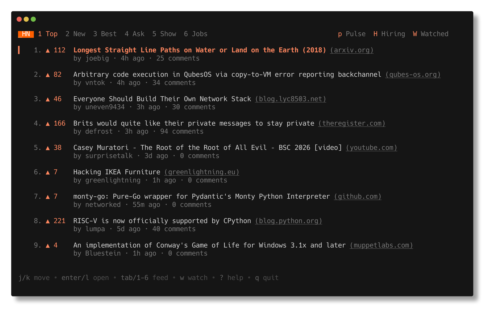
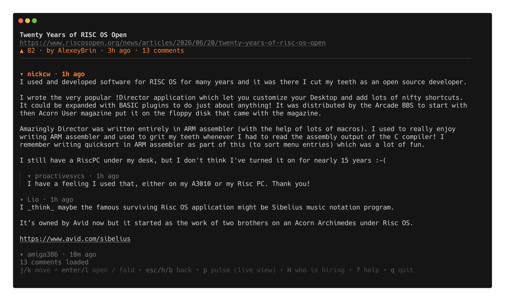
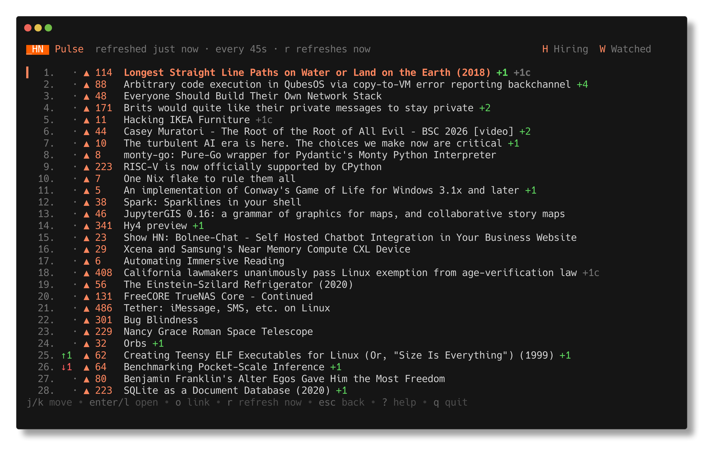

# orange

[](https://github.com/jonhadfield/orange/actions/workflows/ci.yml)
[](https://github.com/jonhadfield/orange/releases/latest)
[](LICENSE)

A terminal reader for [Hacker News](https://news.ycombinator.com), built with
[Bubble Tea](https://github.com/charmbracelet/bubbletea). Read the feeds and
their comment threads, search the whole site, keep an eye on discussions you
care about, and open anything in your browser — without leaving the terminal.



## Features

orange knows the history and the momentum of a story, not just its snapshot:

- **Previously on HN** — opening a story shows earlier submissions of the
  same link; press `1`–`5` to jump straight into a past discussion

  
- **Pulse** (`p`) — an auto-refreshing live view of the front page with rank
  movement (`↑3`), score velocity (`+18`), and new-arrival markers

  
- **Watched threads** (`w` / `W`) — watch a discussion and orange counts the
  comments posted since you last read it and marks each new one in the tree
- **Who is hiring?** (`H`) — finds the latest monthly hiring thread and lets
  you filter job posts by keyword (`/ remote golang`)
- **Search** (`/`) — find stories by keyword across all of Hacker News, not
  just the feed you are looking at, ranked by relevance; `tab` searches
  comments instead, and opening one takes you to its thread

And the fundamentals:

- All six HN feeds: Top, New, Best, Ask, Show, and Jobs
- Threaded, collapsible comment trees, streamed in as they load so large
  discussions stay responsive
- Comment HTML rendered as readable text: paragraphs, emphasis, links, and
  indented code blocks
- Vim-style navigation alongside the arrow keys
- Domains and links are clickable ([OSC 8] hyperlinks) in terminals that
  support them — iTerm2, Kitty, WezTerm, Ghostty, and others; IDE-embedded
  terminals (e.g. JetBrains) may ignore them, where `o`/`c` still work
- Adapts to light and dark terminal backgrounds
- Fetches concurrently and caches items in memory, so switching feeds and
  revisiting stories is instant
- No configuration and no login — it talks only to the official
  [Hacker News API](https://github.com/HackerNews/API) and the
  [HN Algolia API](https://hn.algolia.com/api); the watch list lives in a
  local JSON file

## Install

With [Homebrew](https://brew.sh):

```sh
brew install jonhadfield/tap/orange-cli
```

The installed command is `orange`.

<details>
<summary>Why the cask is <code>orange-cli</code>, and moving from the old one</summary>

An unrelated Homebrew package (Orange Data Mining) owns the `orange` token,
so the cask had to be named `orange-cli`. The command it installs is still
`orange`.

If you installed an earlier version under the old token, switch over with:

```sh
brew uninstall --cask orange
brew install jonhadfield/tap/orange-cli
```

The uninstall is unqualified on purpose: the old `orange` cask is no longer
in the tap, so naming it as `jonhadfield/tap/orange` fails to resolve.
Homebrew still knows about the copy you installed.

</details>

Or, on macOS, with the signed installer:

```sh
curl -fLO https://github.com/jonhadfield/orange/releases/latest/download/orange_macos.pkg
sudo installer -pkg orange_macos.pkg -target /
```

That puts `orange` in `/usr/local/bin`. The package is notarized with a stapled
ticket, so it installs with no Gatekeeper warning; a bare binary from one of the
tarballs is quarantined by the browser and refused instead. Double-clicking the
`.pkg` works too.

Or with Go 1.27 or later:

```sh
go install github.com/jonhadfield/orange/cmd/orange@latest
```

Or from a checkout:

```sh
go build -o orange ./cmd/orange
```

## Usage

```sh
orange            # start reading
orange --help     # the flags, and a pointer at the keys below
orange --version  # print the version
```

### Keys

| Key                 | Action                                        |
| ------------------- | --------------------------------------------- |
| `j` / `k`, `↓` / `↑`| Move selection / scroll                       |
| `g` / `G`           | Jump to top / bottom                          |
| `ctrl+d` / `ctrl+u` | Move half a page; the selection follows       |
| Mouse wheel / trackpad | Scroll; the selection follows              |
| `tab` / `shift+tab` | Next / previous feed                          |
| `1`–`6`             | Jump straight to a feed (on the story list)   |
| `/`                 | Search stories by keyword                     |
| `tab` (in search)   | Switch between story and comment results      |
| `enter` / `l`       | Open story; in a thread, fold/unfold comment  |
| `1`–`5` (in thread) | Open a past discussion of the same link       |
| `o`                 | Open the story link in your browser           |
| `c`                 | Open the HN discussion page in your browser   |
| `w`                 | Watch / unwatch the discussion                |
| `W`                 | Watched stories, with new-comment counts      |
| `p`                 | Pulse: live front page with velocity          |
| `H`                 | Who is hiring? browser                        |
| `/` (in hiring)     | Filter job posts by keywords                  |
| `r`                 | Refresh the current view                      |
| `esc` / `h` / `b`   | Back                                          |
| `?`                 | Toggle help                                   |
| `q`                 | Quit                                          |

Every view carries a top bar with the `p`/`H`/`W` destinations, and a key
bar along the bottom listing what that view responds to — `?` expands it
into the full set for the view you are on. Both give way as the terminal
narrows: the hints drop, the feed tabs window around the one you are
reading, and the reply indentation stops before it squeezes out the
comment text.

### Watch list

The watched stories are the only thing orange keeps on disk, in
`watched.json` under your user config directory — `~/.config/orange/` on
Linux and BSD, `~/Library/Application Support/orange/` on macOS. Nothing
else is stored, and there is no configuration file.

If that file is ever unreadable, orange moves it to `watched.json.corrupt`
and carries on with an empty list, telling you where the old one went, so
watching keeps working and the previous contents are still there to look
at.

### Proxies

orange goes through the usual environment variables. Both API endpoints
are HTTPS, so `HTTPS_PROXY` (or `https_proxy`) is the one that matters;
`NO_PROXY` exempts hosts from it in the normal way.

```sh
export HTTPS_PROXY=http://proxy.example:3128
orange
```

The environment is read once at startup, so set it before launching. A
proxy that intercepts TLS needs its CA certificate in the system trust
store, as orange has no flag to skip or redirect verification.

## Development

```sh
go test ./...
```

Layout: `internal/hn` is the API client (official Firebase API plus the
Algolia search API), `internal/htmltext` converts HN comment HTML to
terminal text, `internal/store` persists the watch list, and `internal/ui`
holds the Bubble Tea models.

## Credits

Written by [Jon Hadfield](https://github.com/jonhadfield), co-authored with
[Claude](https://claude.ai).

## License

[MIT](LICENSE)

[OSC 8]: https://gist.github.com/egmontkob/eb114294efbcd5adb1944c9f3cb5feda
